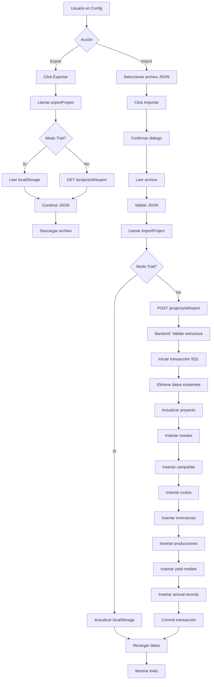

# Análisis de Implementación: Import/Export de Proyectos

## Fecha de Análisis
13 de febrero de 2026

## Estado Actual

### ✅ Controladores Backend Implementados

He revisado los controladores [`class-ccp-export-controller.php`](../includes/api/class-ccp-export-controller.php) y [`class-ccp-import-controller.php`](../includes/api/class-ccp-import-controller.php) y están **bien implementados** con las siguientes características:

#### Export Controller
- **Ruta:** `GET /wp-json/ccp/v1/projects/{id}/export`
- **Permisos:** Verifica autenticación y ownership del proyecto
- **Funcionalidad:** Exporta todos los datos del proyecto en formato JSON
- **Datos exportados:**
  - Información del proyecto (nombre, descripción, ubicación, año inicial)
  - Montes
  - Campañas
  - Costos
  - Inversiones
  - Producciones
  - Modelos de rendimiento
  - Registros anuales
- **Headers:** Incluye `Content-Disposition` para descarga automática

#### Import Controller
- **Ruta:** `POST /wp-json/ccp/v1/projects/{id}/import`
- **Permisos:** Verifica autenticación y ownership del proyecto
- **Funcionalidad:** Importa datos desde JSON y reemplaza datos existentes
- **Características:**
  - Validación de estructura JSON
  - Uso de transacciones SQL (START TRANSACTION, COMMIT, ROLLBACK)
  - Sanitización de datos
  - Manejo de errores robusto

### ⚠️ PROBLEMA CRÍTICO IDENTIFICADO

**Los métodos `delete_by_project()` NO EXISTEN en las clases DB**

El [`CCP_Import_Controller`](../includes/api/class-ccp-import-controller.php:219-227) llama a métodos que no están implementados:

```php
private function delete_existing_project_data( $project_id ) {
    $this->montes_db->delete_by_project( $project_id );           // ❌ NO EXISTE
    $this->campaigns_db->delete_by_project( $project_id );        // ❌ NO EXISTE
    $this->costs_db->delete_by_project( $project_id );            // ❌ NO EXISTE
    $this->investments_db->delete_by_project( $project_id );      // ❌ NO EXISTE
    $this->productions_db->delete_by_project( $project_id );      // ❌ NO EXISTE
    $this->yield_models_db->delete_by_project( $project_id );     // ❌ NO EXISTE
    $this->annual_records_db->delete_by_project( $project_id );   // ❌ NO EXISTE
}
```

**Métodos existentes encontrados:**
- `delete($id, $user_id)` - Elimina por ID individual
- `delete_by_campaign($campaign_id, $user_id)` - Solo en productions
- `delete_permanent($monte_id, $user_id)` - Solo en montes
- `delete_record($project_id, $campaign_id, $type, $category, $user_id)` - Solo en annual_records

### ❌ Controladores NO Registrados

Los controladores existen pero **NO están incluidos** en [`class-ccp-api-manager.php`](../includes/api/class-ccp-api-manager.php). Las rutas de API no están disponibles.

### ❌ Frontend NO Implementado

No existe interfaz de usuario para:
- Exportar proyectos
- Importar proyectos
- No hay funciones en [`projectService.js`](../src/services/projectService.js)

---

## Plan de Implementación Actualizado

### Fase 1: Corregir Clases DB (CRÍTICO)

**Archivos a modificar:**
1. [`includes/db/class-ccp-montes-db.php`](../includes/db/class-ccp-montes-db.php)
2. [`includes/db/class-ccp-campaigns-db.php`](../includes/db/class-ccp-campaigns-db.php)
3. [`includes/db/class-ccp-costs-db.php`](../includes/db/class-ccp-costs-db.php)
4. [`includes/db/class-ccp-investments-db.php`](../includes/db/class-ccp-investments-db.php)
5. [`includes/db/class-ccp-productions-db.php`](../includes/db/class-ccp-productions-db.php)
6. [`includes/db/class-ccp-yield-models-db.php`](../includes/db/class-ccp-yield-models-db.php)
7. [`includes/db/class-ccp-annual-records-db.php`](../includes/db/class-ccp-annual-records-db.php)

**Acción:** Agregar método `delete_by_project($project_id)` en cada clase DB.

**Ejemplo de implementación:**
```php
/**
 * Delete all records by project ID.
 *
 * @param int $project_id Project ID.
 * @return bool True on success, false on failure.
 */
public function delete_by_project( $project_id ) {
    global $wpdb;
    
    if ( ! is_numeric( $project_id ) ) {
        return false;
    }
    
    $result = $wpdb->delete(
        $this->table_name,
        array( 'project_id' => $project_id ),
        array( '%d' )
    );
    
    return $result !== false;
}
```

**Nota:** Para tablas que no tienen `project_id` directo (como `investments` que se relaciona vía `campaign_id`), se necesitará una consulta más compleja:

```php
public function delete_by_project( $project_id ) {
    global $wpdb;
    
    if ( ! is_numeric( $project_id ) ) {
        return false;
    }
    
    // Obtener IDs de campañas del proyecto
    $campaign_ids = $wpdb->get_col( $wpdb->prepare(
        "SELECT id FROM {$wpdb->prefix}ccp_campaigns WHERE project_id = %d",
        $project_id
    ) );
    
    if ( empty( $campaign_ids ) ) {
        return true; // No hay campañas, nada que eliminar
    }
    
    // Eliminar inversiones de esas campañas
    $placeholders = implode( ',', array_fill( 0, count( $campaign_ids ), '%d' ) );
    $result = $wpdb->query( $wpdb->prepare(
        "DELETE FROM {$this->table_name} WHERE campaign_id IN ($placeholders)",
        ...$campaign_ids
    ) );
    
    return $result !== false;
}
```

### Fase 2: Registrar Controladores en API Manager

**Archivo:** [`includes/api/class-ccp-api-manager.php`](../includes/api/class-ccp-api-manager.php)

**Cambios necesarios:**

1. Incluir los archivos de controladores (después de la línea 41):
```php
require_once CALCULADOR_PECAN_PLUGIN_DIR . 'includes/api/class-ccp-export-controller.php';
require_once CALCULADOR_PECAN_PLUGIN_DIR . 'includes/api/class-ccp-import-controller.php';
```

2. Instanciar y registrar rutas (después de la línea 72):
```php
$export_controller = new CCP_Export_Controller();
$export_controller->register_routes();

$import_controller = new CCP_Import_Controller();
$import_controller->register_routes();
```

### Fase 3: Servicios Frontend

**Archivo:** [`src/services/projectService.js`](../src/services/projectService.js)

**Agregar al final del archivo:**

```javascript
/**
 * Exports a project as JSON.
 *
 * @param {number} projectId - The ID of the project to export.
 * @returns {Promise<object>} A promise that resolves to the export data.
 */
export const exportProject = async (projectId) => {
	if (!projectId) {
		return Promise.reject(new Error('Project ID is required.'));
	}
	
	if (isTrialMode()) {
		// En modo trial, exportar desde localStorage
		const projects = JSON.parse(localStorage.getItem(TRIAL_PROJECTS_KEY) || '[]');
		const project = projects.find(p => p.id == projectId);
		if (!project) {
			return Promise.reject(new Error('Project not found.'));
		}
		
		// Construir estructura de export similar al backend
		const exportData = {
			version: '1.0',
			exported_at: new Date().toISOString(),
			project: {
				project_name: project.project_name,
				description: project.description || '',
				pais: project.pais || 'Argentina',
				provincia: project.provincia || '',
				departamento: project.departamento || '',
				municipio: project.municipio || '',
				initial_year: project.initial_year || new Date().getFullYear(),
				allow_benchmarking: project.allow_benchmarking !== false,
			},
			montes: [],
			campaigns: [],
			costs: [],
			investments: [],
			productions: [],
			yield_models: [],
			annual_records: [],
		};
		
		return Promise.resolve(exportData);
	}
	
	return apiRequest(`${BASE_ENDPOINT}/${projectId}/export`);
};

/**
 * Imports project data from JSON.
 *
 * @param {number} projectId - The ID of the project to import into.
 * @param {object|string} jsonData - The JSON data to import (object or string).
 * @returns {Promise<object>} A promise that resolves to the import result.
 */
export const importProject = async (projectId, jsonData) => {
	if (!projectId) {
		return Promise.reject(new Error('Project ID is required.'));
	}
	
	// Convertir a string si es objeto
	const dataString = typeof jsonData === 'string' ? jsonData : JSON.stringify(jsonData);
	
	if (isTrialMode()) {
		// En modo trial, importar a localStorage
		try {
			const importData = typeof jsonData === 'string' ? JSON.parse(jsonData) : jsonData;
			
			// Validar estructura
			if (!importData.project || !importData.version) {
				return Promise.reject(new Error('Invalid import data structure.'));
			}
			
			// Actualizar proyecto en localStorage
			const projects = JSON.parse(localStorage.getItem(TRIAL_PROJECTS_KEY) || '[]');
			const index = projects.findIndex(p => p.id == projectId);
			
			if (index === -1) {
				return Promise.reject(new Error('Project not found.'));
			}
			
			// Actualizar datos del proyecto
			projects[index] = {
				...projects[index],
				...importData.project,
				updated_at: new Date().toISOString(),
			};
			
			localStorage.setItem(TRIAL_PROJECTS_KEY, JSON.stringify(projects));
			
			return Promise.resolve({ success: true, message: 'Project imported successfully.' });
		} catch (error) {
			return Promise.reject(new Error('Error importing project: ' + error.message));
		}
	}
	
	return apiRequest(`${BASE_ENDPOINT}/${projectId}/import`, {
		method: 'POST',
		body: JSON.stringify({ data: dataString }),
	});
};
```

### Fase 4: Interfaz de Usuario

**Archivo:** [`src/pages/Config.tsx`](../src/pages/Config.tsx)

**Ubicación:** Agregar nueva sección después de las tarjetas existentes (alrededor de la línea 400-500)

**Componente a agregar:**

```tsx
{/* Sección Import/Export */}
<Card>
  <CardHeader>
    <CardTitle className="flex items-center gap-2">
      <Database className="h-5 w-5" />
      Import/Export de Proyecto
    </CardTitle>
  </CardHeader>
  <CardContent className="space-y-4">
    <div className="space-y-2">
      <Label>Exportar Proyecto</Label>
      <p className="text-sm text-muted-foreground">
        Descarga todos los datos del proyecto actual en formato JSON. 
        Útil para crear respaldos o transferir datos.
      </p>
      <Button 
        onClick={handleExportProject}
        disabled={!currentProjectId || isExporting}
        className="w-full"
      >
        {isExporting ? (
          <>
            <Loader2 className="mr-2 h-4 w-4 animate-spin" />
            Exportando...
          </>
        ) : (
          <>
            <Download className="mr-2 h-4 w-4" />
            Exportar Proyecto
          </>
        )}
      </Button>
    </div>

    <div className="space-y-2">
      <Label>Importar Proyecto</Label>
      <p className="text-sm text-muted-foreground">
        Importa datos desde un archivo JSON exportado previamente. 
        <strong className="text-destructive"> Esto reemplazará todos los datos actuales del proyecto.</strong>
      </p>
      <Input
        type="file"
        accept=".json"
        onChange={handleFileSelect}
        disabled={!currentProjectId || isImporting}
        ref={fileInputRef}
      />
      <AlertDialog>
        <AlertDialogTrigger asChild>
          <Button 
            variant="destructive"
            disabled={!currentProjectId || !selectedFile || isImporting}
            className="w-full"
          >
            {isImporting ? (
              <>
                <Loader2 className="mr-2 h-4 w-4 animate-spin" />
                Importando...
              </>
            ) : (
              <>
                <Upload className="mr-2 h-4 w-4" />
                Importar Proyecto
              </>
            )}
          </Button>
        </AlertDialogTrigger>
        <AlertDialogContent>
          <AlertDialogHeader>
            <AlertDialogTitle>¿Estás seguro?</AlertDialogTitle>
            <AlertDialogDescription>
              Esta acción reemplazará TODOS los datos actuales del proyecto con los datos del archivo JSON.
              Esta operación no se puede deshacer. Se recomienda exportar el proyecto actual antes de importar.
            </AlertDialogDescription>
          </AlertDialogHeader>
          <AlertDialogFooter>
            <AlertDialogCancel>Cancelar</AlertDialogCancel>
            <AlertDialogAction onClick={handleImportProject}>
              Sí, importar datos
            </AlertDialogAction>
          </AlertDialogFooter>
        </AlertDialogContent>
      </AlertDialog>
    </div>
  </CardContent>
</Card>
```

**Estados y funciones a agregar:**

```tsx
// Estados
const [isExporting, setIsExporting] = useState(false);
const [isImporting, setIsImporting] = useState(false);
const [selectedFile, setSelectedFile] = useState<File | null>(null);
const fileInputRef = useRef<HTMLInputElement>(null);

// Importar iconos adicionales
import { Download, Upload } from "lucide-react";

// Importar funciones de servicio
import { exportProject, importProject } from "@/services/projectService";

// Función para exportar
const handleExportProject = async () => {
  if (!currentProjectId) return;
  
  setIsExporting(true);
  try {
    const exportData = await exportProject(currentProjectId);
    
    // Crear blob y descargar
    const blob = new Blob([JSON.stringify(exportData, null, 2)], { 
      type: 'application/json' 
    });
    const url = URL.createObjectURL(blob);
    const link = document.createElement('a');
    link.href = url;
    link.download = `project_${currentProjectId}_export_${new Date().toISOString().split('T')[0]}.json`;
    document.body.appendChild(link);
    link.click();
    document.body.removeChild(link);
    URL.revokeObjectURL(url);
    
    toast({
      title: "Proyecto exportado",
      description: "El archivo JSON se ha descargado correctamente.",
    });
  } catch (error) {
    console.error("Error exporting project:", error);
    toast({
      title: "Error al exportar",
      description: "No se pudo exportar el proyecto. Intenta nuevamente.",
      variant: "destructive",
    });
  } finally {
    setIsExporting(false);
  }
};

// Función para seleccionar archivo
const handleFileSelect = (e: React.ChangeEvent<HTMLInputElement>) => {
  const file = e.target.files?.[0];
  if (file) {
    setSelectedFile(file);
  }
};

// Función para importar
const handleImportProject = async () => {
  if (!currentProjectId || !selectedFile) return;
  
  setIsImporting(true);
  try {
    // Leer archivo
    const fileContent = await selectedFile.text();
    
    // Validar JSON
    let jsonData;
    try {
      jsonData = JSON.parse(fileContent);
    } catch (e) {
      throw new Error('El archivo no contiene JSON válido.');
    }
    
    // Importar
    await importProject(currentProjectId, jsonData);
    
    toast({
      title: "Proyecto importado",
      description: "Los datos se han importado correctamente. Recargando...",
    });
    
    // Recargar datos del proyecto
    await loadProjects();
    await loadCampaigns(currentProjectId);
    
    // Limpiar input
    setSelectedFile(null);
    if (fileInputRef.current) {
      fileInputRef.current.value = '';
    }
    
  } catch (error) {
    console.error("Error importing project:", error);
    toast({
      title: "Error al importar",
      description: error instanceof Error ? error.message : "No se pudo importar el proyecto.",
      variant: "destructive",
    });
  } finally {
    setIsImporting(false);
  }
};
```

---

## Diagrama de Flujo: Proceso de Import/Export



---

## Consideraciones de Seguridad

### ✅ Implementadas en Controladores

1. **Autenticación:** Verifica `is_user_logged_in()`
2. **Autorización:** Verifica ownership del proyecto
3. **Roles:** Bloquea subscribers
4. **Sanitización:** Usa `sanitize_text_field()`, `sanitize_textarea_field()`
5. **Validación:** Verifica estructura JSON
6. **Transacciones:** Usa START TRANSACTION/COMMIT/ROLLBACK

### ⚠️ Consideraciones Adicionales

1. **Tamaño de archivo:** Considerar límite de tamaño para imports
2. **Timeout:** Proyectos grandes pueden exceder tiempo de ejecución PHP
3. **Validación de datos:** Validar rangos numéricos y tipos de datos
4. **Logging:** Registrar imports/exports para auditoría

---

## Testing Recomendado

### Pruebas Backend

1. **Export:**
   - ✅ Exportar proyecto vacío
   - ✅ Exportar proyecto con datos completos
   - ✅ Verificar permisos (usuario sin acceso)
   - ✅ Verificar formato JSON
   - ✅ Verificar headers de descarga

2. **Import:**
   - ✅ Importar JSON válido
   - ✅ Importar JSON inválido (estructura incorrecta)
   - ✅ Importar con datos faltantes
   - ✅ Verificar rollback en caso de error
   - ✅ Verificar que datos antiguos se eliminan
   - ✅ Verificar permisos

### Pruebas Frontend

1. **Export:**
   - ✅ Descargar archivo JSON
   - ✅ Verificar nombre de archivo
   - ✅ Verificar contenido del archivo
   - ✅ Probar en modo trial

2. **Import:**
   - ✅ Seleccionar archivo
   - ✅ Importar archivo válido
   - ✅ Importar archivo inválido
   - ✅ Verificar diálogo de confirmación
   - ✅ Verificar recarga de datos
   - ✅ Probar en modo trial

---

## Resumen de Archivos a Modificar

### Backend (PHP)
1. ✅ [`includes/api/class-ccp-export-controller.php`](../includes/api/class-ccp-export-controller.php) - Ya implementado
2. ✅ [`includes/api/class-ccp-import-controller.php`](../includes/api/class-ccp-import-controller.php) - Ya implementado
3. ⚠️ [`includes/api/class-ccp-api-manager.php`](../includes/api/class-ccp-api-manager.php) - Registrar controladores
4. ⚠️ [`includes/db/class-ccp-montes-db.php`](../includes/db/class-ccp-montes-db.php) - Agregar delete_by_project
5. ⚠️ [`includes/db/class-ccp-campaigns-db.php`](../includes/db/class-ccp-campaigns-db.php) - Agregar delete_by_project
6. ⚠️ [`includes/db/class-ccp-costs-db.php`](../includes/db/class-ccp-costs-db.php) - Agregar delete_by_project
7. ⚠️ [`includes/db/class-ccp-investments-db.php`](../includes/db/class-ccp-investments-db.php) - Agregar delete_by_project
8. ⚠️ [`includes/db/class-ccp-productions-db.php`](../includes/db/class-ccp-productions-db.php) - Agregar delete_by_project
9. ⚠️ [`includes/db/class-ccp-yield-models-db.php`](../includes/db/class-ccp-yield-models-db.php) - Agregar delete_by_project
10. ⚠️ [`includes/db/class-ccp-annual-records-db.php`](../includes/db/class-ccp-annual-records-db.php) - Agregar delete_by_project

### Frontend (TypeScript/JavaScript)
1. ⚠️ [`src/services/projectService.js`](../src/services/projectService.js) - Agregar exportProject e importProject
2. ⚠️ [`src/pages/Config.tsx`](../src/pages/Config.tsx) - Agregar UI de import/export

---

## Prioridad de Implementación

### 🔴 CRÍTICO (Debe hacerse primero)
1. Agregar métodos `delete_by_project()` en todas las clases DB
2. Registrar controladores en API Manager

### 🟡 ALTA (Funcionalidad principal)
3. Agregar funciones de servicio en frontend
4. Agregar UI en página de configuración

### 🟢 MEDIA (Mejoras)
5. Testing exhaustivo
6. Documentación de usuario
7. Manejo de errores mejorado

---

## Conclusión

Los controladores de import/export están bien diseñados e implementados, pero tienen una **dependencia crítica** en métodos que no existen en las clases DB. Una vez corregido esto y registrados los controladores, la funcionalidad estará lista para ser utilizada desde el frontend.

La implementación del frontend es directa y sigue los patrones existentes en el proyecto.
